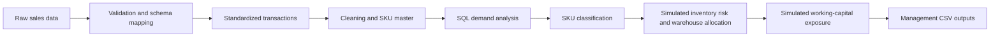

# E-Commerce Inventory, Warehouse & Working Capital Analytics

## Overview

This portfolio project turns public e-commerce transaction data into SKU-level decision support for finance and operations teams. It connects sales history to product prioritization, replenishment review, inventory risk, warehouse strategy, and working-capital exposure.

The repository includes two parallel paths:

- An original five-notebook workflow built for the UCI Online Retail dataset.
- A standardized-input preparation workflow that validates and maps source columns before running equivalent analysis in the `b` notebooks.

The standardized path demonstrates how the analysis can be adapted to future datasets without replacing the original portfolio workflow yet.

## Business Value

The analysis translates transaction records into decisions that matter across several business functions:

| Business area | Decision support produced |
| --- | --- |
| Inventory planning | Identifies replenishment candidates, stockout risk, overstock risk, safety stock, and reorder points. |
| Operations | Segments SKUs by revenue, turnover, and demand volatility to support differentiated inventory policies. |
| Warehouse management | Assigns simulated warehouse strategies and summarizes SKU allocation segments. |
| Finance | Estimates simulated inventory value, stockout revenue exposure, and overstock capital exposure. |
| Management reporting | Produces concise KPI tables and ranked review lists for operational follow-up. |

Rather than applying one inventory policy to every product, the workflow distinguishes core revenue drivers, stable and volatile high-turnover items, regular products, and long-tail SKUs.

## Business Questions

1. Which SKUs contribute the most revenue and unit demand?
2. Which products should receive replenishment priority?
3. Which SKUs may create stockout or overstock risk?
4. Which products belong in local warehouses versus limited-stock strategies?
5. How much simulated inventory value and financial exposure sits within each SKU class and warehouse strategy?

## End-to-End Workflow



The original workflow starts directly from the UCI workbook. The standardized-input workflow adds validation and schema mapping, then writes downstream processed and analytical outputs to separate standardized directories so the original notebook outputs remain unchanged.

## Analytical Components

### 01 — Data Cleaning

- Removes exact duplicates and invalid sales records.
- Separates returns and cancellations.
- Excludes postage, fees, discounts, bank charges, manual adjustments, and other non-product lines.
- Creates clean sales, monthly SKU sales, a normalized SKU master, description checks, and a data-quality summary.

### 02 — SQL Business Analysis

- Loads cleaned product sales into SQLite.
- Produces top-SKU revenue and unit contribution, long-tail SKU, country demand, and monthly trend outputs.

### 03 — SKU Classification

- Builds one profile per normalized SKU.
- Classifies SKUs as High-Revenue Priority, High-Turnover Stable, High-Turnover Volatile, Long-Tail, or Regular.
- Uses revenue contribution, sales volume, and demand volatility while retaining descriptions for display.

### 04 — Replenishment and Warehouse Allocation

- Applies deterministic simulated inventory assumptions.
- Calculates daily demand, safety stock, reorder point, replenishment quantity, inventory coverage, and inventory risk.
- Assigns warehouse strategies and creates management KPI summaries.

### 05 — Working Capital Impact

- Estimates simulated inventory value.
- Quantifies simulated stockout revenue exposure and overstock capital exposure.
- Summarizes exposure by SKU class and warehouse strategy.

## Standardized Reusable Input Workflow

The standardized path adds a schema-controlled preparation layer for future reusable pipeline refactoring:

1. `scripts/validate_input_data.py` checks required fields and common data-quality issues.
2. `scripts/standardize_raw_sales.py` maps configured source columns to canonical names; the template defines five required fields and three optional mappings.
3. Notebooks `01b` through `05b` reproduce the analytical workflow using standardized inputs.
4. The standardized transaction file is written to `data/interim/`; downstream CSVs are written to `data/processed_standardized/` and `outputs_standardized/`. These generated standardized CSVs are ignored by Git.

The `b` notebooks are preparation layers. They do not replace the original notebooks yet.

### SKU definition

`stock_code` is the normalized SKU key throughout the standardized workflow. `description` is a display field, not part of the grouping key. This prevents description variations from splitting one stock code into multiple SKU profiles.

## Key Results

### Data preparation

- Valid product sales transactions: 522,716 rows
- Returns and cancellations: 10,587 rows
- Non-product transaction rows excluded: 2,162 rows
- Monthly SKU-level sales records: 34,020 rows
- SKU master records: 3,917 SKUs
- SKU profiles classified: 3,917 SKUs

### SKU portfolio

| SKU class | SKU count | Selected contribution metrics |
| --- | ---: | --- |
| High-Revenue Priority | 784 | Approximately 78.8% of revenue and 66.1% of units |
| Regular | 1,684 | — |
| High-Turnover Stable | 208 | — |
| High-Turnover Volatile | 69 | — |
| Long-Tail | 1,172 | Approximately 1.3% of revenue and 0.6% of units |

### Simulated inventory risk

- Normal inventory position: 1,561 SKUs
- Stockout Risk: 1,432 SKUs
- Overstock Risk: 924 SKUs

### Simulated warehouse strategy

- `warehouse_strategy_count`: 6 unique warehouse strategies
- `warehouse_allocation_segment_count`: 7 SKU classification × warehouse strategy summary combinations
- Local Warehouse Priority: 784 SKUs
- Stable Local Warehouse Inventory: 208 SKUs
- Small-Batch Replenishment / Monitor Closely: 69 SKUs
- External or Limited Stock Strategy: 335 SKUs
- Overstock Review / Reduce Replenishment: 924 SKUs
- Standard Replenishment Review: 1,597 SKUs

### Simulated working-capital impact

- Total SKUs analyzed: 3,917
- Stockout Risk SKUs: 1,432
- Overstock Risk SKUs: 924
- Estimated inventory value: 1,090,613.07
- Stockout revenue exposure: 645,275.56
- Overstock capital exposure: 124,125.96

## Representative Outputs

| Output file | Business use |
| --- | --- |
| `data/processed/clean_sales.csv` | Analysis-ready valid product transactions. |
| `data/processed/sku_master.csv` | SKU reference table keyed by `stock_code`. |
| `outputs/sku_profile_classification.csv` | SKU segmentation with revenue, demand, and volatility measures. |
| `outputs/replenishment_recommendations.csv` | Prioritized replenishment review list based on simulated inventory. |
| `outputs/overstock_risk_list.csv` | SKUs requiring simulated overstock review. |
| `outputs/warehouse_allocation_summary.csv` | SKU-class-by-warehouse-strategy allocation summary. |
| `outputs/management_kpi_summary.csv` | Consolidated operational and inventory KPIs. |
| `outputs/working_capital_summary.csv` | Finance-facing simulated inventory and exposure summary. |
| `outputs/top_overstock_capital_exposure.csv` | Highest simulated overstock capital exposures. |
| `outputs/top_stockout_revenue_exposure.csv` | Highest simulated stockout revenue exposures. |

The standardized workflow creates equivalent outputs under `data/processed_standardized/` and `outputs_standardized/`.

## Tools and Skills Demonstrated

- Python and pandas for validation, transformation, aggregation, and deterministic simulation
- SQLite and SQL for business analysis
- Schema mapping and reusable input standardization
- SKU segmentation and demand-volatility analysis
- Inventory, warehouse, and working-capital KPI design
- Reproducible Jupyter notebook workflows and CSV output contracts

## How to Run

### Setup

Create and activate a virtual environment:

```bash
python -m venv .venv
source .venv/bin/activate
```

On Windows:

```powershell
.venv\Scripts\activate
```

Install dependencies:

```bash
pip install -r requirements.txt
```

Place the UCI workbook at:

```text
data/raw/Online Retail.xlsx
```

### Option A — Original notebook workflow

Run these notebooks in order:

1. `notebooks/01_data_cleaning.ipynb`
2. `notebooks/02_sql_business_queries.ipynb`
3. `notebooks/03_sku_classification.ipynb`
4. `notebooks/04_replenishment_warehouse_allocation.ipynb`
5. `notebooks/05_working_capital_impact.ipynb`

Review the generated files in:

```text
data/processed/
outputs/
```

### Option B — Standardized-input workflow

From the project root, validate the source data:

```bash
python scripts/validate_input_data.py \
  --input "data/raw/Online Retail.xlsx" \
  --mapping "config/schema_mapping_template.csv" \
  --output "outputs/data_quality_precheck.csv"
```

Create the standardized transaction file:

```bash
python scripts/standardize_raw_sales.py \
  --input "data/raw/Online Retail.xlsx" \
  --mapping "config/schema_mapping_template.csv" \
  --output "data/interim/standardized_sales.csv"
```

Then run these notebooks in order:

1. `notebooks/01b_data_cleaning_standardized_input.ipynb`
2. `notebooks/02b_sql_business_queries_standardized_input.ipynb`
3. `notebooks/03b_sku_classification_standardized_input.ipynb`
4. `notebooks/04b_replenishment_warehouse_allocation_standardized_input.ipynb`
5. `notebooks/05b_working_capital_impact_standardized_input.ipynb`

Review the generated files in:

```text
data/processed_standardized/
outputs_standardized/
```

## Repository Structure

```text
ecommerce-inventory-warehouse-allocation/
├── config/
│   └── schema_mapping_template.csv
├── data/
│   ├── raw/
│   ├── interim/
│   ├── processed/
│   └── processed_standardized/
├── notebooks/
│   ├── 01_data_cleaning.ipynb ... 05_working_capital_impact.ipynb
│   └── 01b_data_cleaning_standardized_input.ipynb ... 05b_working_capital_impact_standardized_input.ipynb
├── outputs/
├── outputs_standardized/
├── scripts/
│   ├── validate_input_data.py
│   └── standardize_raw_sales.py
├── docs/
│   ├── management_summary.md
│   └── runbook.md
├── README.md
└── requirements.txt
```

## Data Source

The project uses the public [UCI Online Retail dataset](https://archive.ics.uci.edu/dataset/352/online+retail), which contains invoice-level product sales with quantity, date, price, customer, and country fields. No confidential company data is used.

## Assumptions and Limitations

The source dataset does not include actual inventory balances, supplier lead times, unit costs, storage volumes, warehouse capacity, or fulfillment assignments.

Inventory, warehouse, cost, stockout-risk, overstock-risk, and financial-exposure fields are simulated for portfolio demonstration. The deterministic assumptions support reproducibility, but the resulting recommendations and monetary values are not real company inventory data, operational decisions, or accounting figures.

The standardized-input notebooks are a preparation layer for future pipeline refactoring. They are not yet a packaged production pipeline and do not replace the original workflow.
