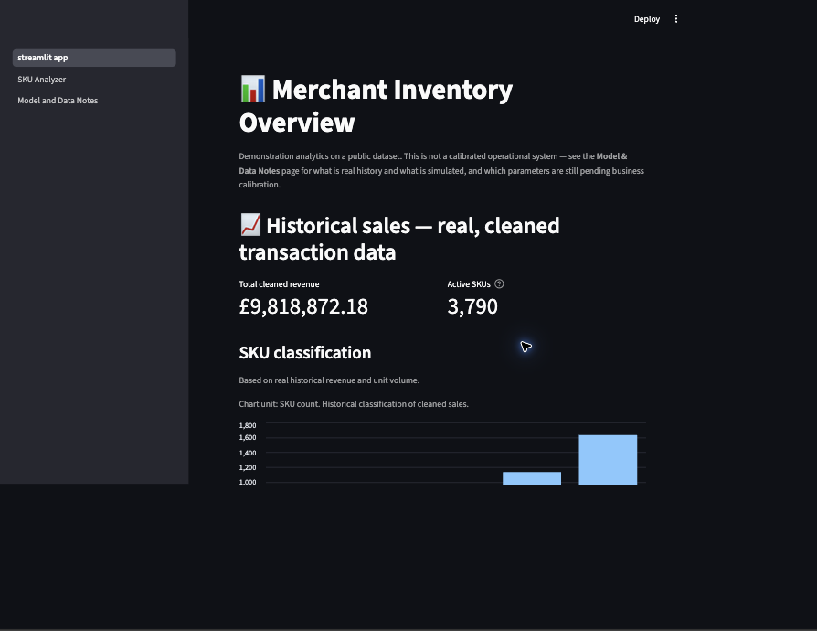

# E-Commerce Inventory, Warehouse & Working Capital Analytics

> **📊 [Try the interactive merchant dashboard](#merchant-analytics-app-read-only-mvp)** — a read-only Streamlit app built on this project's own outputs. Jump to [setup](#setup) to run it locally.

**Contents:** [Overview](#overview) · [Business Questions](#business-questions) · [Key Results](#key-results) · [Merchant analytics app](#merchant-analytics-app-read-only-mvp) · [How to Run](#how-to-run) · [Data Source](#data-source) · [Assumptions and Limitations](#assumptions-and-limitations)

## Overview

This portfolio project turns public e-commerce transaction data into SKU-level decision support for finance and operations teams. It connects sales history to product prioritization, replenishment review, inventory risk, warehouse strategy, and working-capital exposure. A read-only [interactive dashboard](#merchant-analytics-app-read-only-mvp) built on the same outputs lets a non-technical merchant explore the results directly.

The workflow validates and standardizes the raw file, cleans it with tested rules, and then runs five analysis notebooks in sequence. All monetary values are in GBP, the currency of the source data.



## Data Quality Highlight

Compared with the original pipeline, the corrected cleaning step lowers revenue by **£447,212 (4.4%)**. The review found these causes:

- **Cancelled orders counted as sales.** Two orders of 80,995 and 74,215 units were cancelled within minutes but still counted, which pushed both SKUs into the top 10 by revenue.
- **A keying error reversed off-ledger.** A £38,970 line (60 × £649.50) was reversed by a manual credit note rather than a cancellation of the same stock code, so it needed its own reviewed rule.
- **A bad-debt adjustment treated as a product.** A £11,062 "Adjust bad debt" line was classified as a top SKU and carried 38.8% of the simulated inventory value.
- **Other non-product lines and split codes.** Carriage, packing charges, gift vouchers, and samples were still in the product data, and 112 products were split across lower-case and upper-case stock codes.

Cancellations are matched to sales at the same unit price where possible, and every removed line records its match quality.

[`reports/phase1_data_correctness.md`](reports/phase1_data_correctness.md) holds:
- the fixes and a reconciliation of the revenue change;
- tables against the original baseline;
- a separate table for the revision made within Phase 1 after an external review.

## Business Questions

1. Which SKUs contribute the most revenue and unit demand?
2. Which products should receive replenishment priority?
3. Which SKUs may create stockout or overstock risk?
4. Which products belong in local warehouses versus limited-stock strategies?
5. How much simulated inventory value and financial exposure sits within each SKU class and warehouse strategy?

## End-to-End Workflow


```mermaid
flowchart LR
    A[Raw sales file] --> B[Validate against schema mapping]
    B --> C[Standardized transactions]
    C --> D[01 Cleaning and SKU master]
    D --> E[02 SQL demand analysis]
    E --> F[03 SKU classification]
    F --> G[04 Simulated inventory risk and warehouse allocation]
    G --> H[05 Simulated working-capital exposure]
    H --> I[Management CSV outputs]
```

## Analytical Components

### 01 — Data Cleaning

- Cleaning rules live in `src/retail_analytics/cleaning.py` and are unit-tested in `tests/test_cleaning.py`.
- Stock codes are normalized: trimmed and upper-cased.
- Exact duplicates and invalid lines are removed; returns and cancellations are saved separately.
- Non-product lines are excluded using `config/non_product_stock_codes.csv`; the loader rejects blank, duplicate, or overlapping rules.
- Sales reversed by a reviewed manual credit (`config/manual_reversals.csv`) are removed.
- Sales that the same customer later cancelled in full are removed, preferring a sale at the same unit price.
- Review lists (nothing is removed from these): manual-credit candidates and price anomalies.
- Outputs: clean sales, reversed sales with match quality, SKU master, monthly SKU sales, month coverage, and a data-quality summary.

### 02 — SQL Business Analysis

- Loads cleaned sales into in-memory SQLite and uses CTEs and joins to the SKU master and month-coverage tables.
- Produces top-SKU revenue and unit contribution, long-tail SKUs, country demand, and a monthly trend that flags truncated months.

### 03 — SKU Classification

- Builds a SKU × month demand panel (`src/retail_analytics/demand.py`) over the 12 full months, zero-filled from each SKU's first sale month; the truncated December 2011 is excluded.
- Builds one profile per SKU: totals over all months, demand statistics from the panel, and a `short_history` flag for SKUs with fewer than 3 months.
- Classifies each SKU as High-Revenue Priority, High-Turnover Stable, High-Turnover Volatile, Long-Tail, or Regular.
  - Revenue, volume, and long-tail cut-offs are percentiles.
  - A high-turnover SKU is volatile when its demand CV is above 1.0 or its history is short.

### 04 — Replenishment and Warehouse Allocation

- Simulates inventory, lead time, storage volume, and unit cost from `config/simulation_assumptions.json` (`src/retail_analytics/simulation.py`).
  - Each SKU's draws come from a hash of the seed, field, and stock code, so they do not change when other SKUs are added, removed, or re-ordered.
  - The model is selected per field in `config/simulation_assumptions.json`'s `methods` block. The current configuration uses a reorder-point-plus-EOQ policy band for current inventory, a per-class service-level target for safety stock (z-score × monthly demand volatility × √lead time), an EOQ formula (capped at 180 days of coverage) for order quantity, and a max-stock rule for overstock. A simpler fixed-range/volatility-factor/top-up model is also supported and used for before/after comparison (`reports/baseline_end_phase3a/`).
- Saves the full simulated layer to `outputs/sku_inventory_simulation.csv`.
- Calculates daily demand, safety stock, reorder point, EOQ, replenishment quantity, inventory coverage, and inventory risk.
- Assigns warehouse strategies and builds a management KPI table from the data-quality summary, with no hardcoded values.

### 05 — Working Capital Impact

- Reads the simulated layer saved by notebook 04, and checks that a fresh simulation reproduces it exactly.
- Estimates simulated inventory value, stockout revenue exposure, and overstock capital exposure.
- Summarizes exposure by SKU class and warehouse strategy.

## Key Results

### Data preparation

| Step | Rows |
| --- | ---: |
| Raw transactions | 541,909 |
| After duplicate removal | 536,641 |
| Returns and cancellations separated | 10,587 |
| Non-product lines excluded | 2,435 |
| Sales reversed by a reviewed manual credit | 1 |
| Sales fully reversed by a cancellation | 2,815 |
| **Valid product sales lines** | **519,627** |
| Monthly SKU sales records | 33,360 |
| SKUs | 3,790 |

Clean sales total £9.82M of revenue across 19,646 orders and 38 countries. The United Kingdom accounts for 84.7% of revenue, and 25.3% of lines have no customer ID; those lines are kept because the analysis is SKU-level.

### SKU portfolio

| SKU class | SKUs | Revenue share | Unit share |
| --- | ---: | ---: | ---: |
| High-Revenue Priority | 758 | 77.8% | 64.6% |
| Regular | 1,631 | 16.2% | 18.6% |
| High-Turnover Stable | 182 | 3.3% | 10.8% |
| Long-Tail | 1,133 | 1.5% | 0.7% |
| High-Turnover Volatile | 86 | 1.2% | 5.3% |

About 20% of SKUs generate 78% of revenue, while about 30% of SKUs generate 1.5%.

On the zero-filled monthly basis, median demand is 38.0 units per month with a median CV of 1.01. Averaging only the months with sales would overstate demand at least twofold for 827 SKUs; see [`reports/phase3a_demand_and_simulation.md`](reports/phase3a_demand_and_simulation.md).

### Simulated inventory risk

- Normal: 2,246 SKUs
- Stockout Risk: 536 SKUs
- Overstock Risk: 1,008 SKUs

### Simulated warehouse strategy

| Warehouse strategy | SKUs |
| --- | ---: |
| Standard Replenishment Review | 1,164 |
| Overstock Review / Reduce Replenishment | 1,008 |
| Local Warehouse Priority | 748 |
| External or Limited Stock Strategy | 626 |
| Stable Local Warehouse Inventory | 171 |
| Small-Batch Replenishment / Monitor Closely | 73 |

These are 6 strategies, forming 7 SKU-class × strategy segments.

### Simulated working-capital impact (GBP)

| Metric | Value |
| --- | ---: |
| Estimated inventory value | 1,805,589.48 |
| Annual holding cost | 451,397.56 |
| Stockout revenue exposure | 84,414.16 |
| Overstock capital exposure | 53,315.26 |

Stockout revenue exposure is the shortfall to the reorder point valued at selling price. It is an upper-bound indicator of sales at risk, not a forecast of lost revenue. Annual holding cost is only computed when the order-quantity method is EOQ; a simpler model without EOQ leaves it unavailable rather than defaulting to zero.

## Representative Outputs

| Output file | Business use |
| --- | --- |
| `data/processed/clean_sales.csv` | Analysis-ready product sales lines (generated locally, not committed) |
| `data/processed/sku_master.csv` | SKU reference table keyed by `stock_code` |
| `data/processed/reversed_sales.csv` | Removed sales with reversal type, matched credit, price difference, and match quality |
| `data/processed/price_anomalies.csv` | Lines priced at least 10× their SKU median, for review |
| `data/processed/manual_credit_candidates.csv` | Manual credits that may reverse a sale line, for review |
| `data/processed/data_quality_summary.csv` | Row counts for every cleaning step |
| `outputs/sku_profile_classification.csv` | SKU segmentation with revenue, demand, and volatility measures |
| `outputs/replenishment_recommendations.csv` | Prioritized replenishment review list based on simulated inventory |
| `outputs/overstock_risk_list.csv` | SKUs requiring simulated overstock review |
| `outputs/warehouse_allocation_summary.csv` | SKU class × warehouse strategy summary |
| `outputs/management_kpi_summary.csv` | Consolidated operational and inventory KPIs |
| `outputs/working_capital_summary.csv` | Finance-facing simulated inventory and exposure summary |
| `reports/phase1_before_after.csv` | Impact of the data-correctness fixes, compared with the original baseline |
| `data/processed/sku_month_demand.csv` | Zero-filled SKU × month demand panel |
| `outputs/sku_inventory_simulation.csv` | Full simulated inventory layer shared by notebooks 04 and 05 |
| `reports/phase3a_before_after.csv` | Impact of the demand-basis and simulation changes, compared with the end of Phase 1 |

## Tools and Skills Demonstrated

- Python and pandas for validation, transformation, aggregation, and deterministic simulation
- SQL (SQLite) with CTEs and joins for business reporting
- Data-quality investigation, rule design, and before/after reconciliation
- Schema mapping and reusable input standardization
- SKU segmentation and demand-volatility analysis
- Inventory, warehouse, and working-capital KPI design
- Demand-panel construction (zero-filled months) and deterministic, order-independent simulation
- Unit testing with pytest and reproducible notebook execution

## How to Run

### Setup

```bash
python -m venv .venv
source .venv/bin/activate        # Windows: .venv\Scripts\activate
python -m pip install -r requirements-dev.txt
```

Place the UCI workbook at `data/raw/Online Retail.xlsx`.

### Run the pipeline

From the project root:

```bash
python scripts/validate_input_data.py \
  --input "data/raw/Online Retail.xlsx" \
  --mapping "config/schema_mapping_template.csv" \
  --output "outputs/data_quality_precheck.csv"

python scripts/standardize_raw_sales.py \
  --input "data/raw/Online Retail.xlsx" \
  --mapping "config/schema_mapping_template.csv" \
  --output "data/interim/standardized_sales.csv"
```

Then run the notebooks in order, either interactively or from the command line:

```bash
jupyter nbconvert --to notebook --execute --inplace notebooks/0*.ipynb
```

1. `notebooks/01_data_cleaning.ipynb`
2. `notebooks/02_sql_business_queries.ipynb`
3. `notebooks/03_sku_classification.ipynb`
4. `notebooks/04_replenishment_warehouse_allocation.ipynb`
5. `notebooks/05_working_capital_impact.ipynb`

### Tests and baseline comparison

```bash
python -m pytest -W error
python scripts/compare_to_baseline.py --baseline reports/baseline_before_phase1 --current reports/baseline_end_phase1 --prefix phase1
python scripts/compare_to_baseline.py --baseline reports/baseline_end_phase1 --current reports/baseline_end_phase3a --prefix phase3a
python scripts/check_simulation_stability.py
```

To run the whole chain (validation, standardization, notebooks 01–05, comparisons, and tests) in one step:

```bash
mkdir -p tmp && bash scripts/verify_pipeline.sh > tmp/verify_pipeline.log 2>&1
```

### Merchant analytics app (read-only MVP)

A read-only [Streamlit](https://streamlit.io) app for non-technical merchant/operations users, built on the same notebook outputs above — see [`docs/app_product_spec.md`](docs/app_product_spec.md) for the full product spec. It never re-runs the pipeline or writes any file. It only passes an explicit allowlist of pre-aggregated, SKU-level fields from the notebook outputs to pages; a source whose original header declares `customer_id`, `invoice_no`, `invoice_date`, or another forbidden order/customer identifier is rejected before that selection. `.streamlit/config.toml` also disables Streamlit usage-stat collection for the project.

```bash
python -m pip install -r requirements-dev.txt   # includes requirements-app.txt (Streamlit)
streamlit run app/streamlit_app.py
```

This opens in your browser at `http://localhost:8501`. Stop it with `Ctrl+C` in the terminal. Three pages (left sidebar):

1. **Merchant Inventory Overview** (`app/streamlit_app.py`) — clean historical revenue and SKU-class mix, alongside simulated stockout/overstock counts, simulated inventory value, and warehouse-strategy distribution. Historical and simulated figures are shown in clearly separate sections.
2. **SKU Analyzer** (`app/pages/1_SKU_Analyzer.py`) — search/filter SKUs by code, description, class, simulated risk, or warehouse strategy; drill into one SKU's historical monthly sales trend and simulated safety stock/reorder point/EOQ/replenishment recommendation, with an explicit uncertainty notice for SKUs with under 3 months of history.
3. **Model & Data Notes** (`app/pages/2_Model_and_Data_Notes.py`) — data coverage and cleaning-rule summary, plain-language explanations of the simulation formulas, which parameters are still demonstration/pending-calibration, the app's privacy boundaries, and links to the fuller docs.

The app's data-access layer (`src/retail_analytics/dashboard_data.py`) is tested independently of Streamlit in `tests/test_dashboard_data.py`; `tests/test_app_pages.py` runs the three pages themselves via Streamlit's `AppTest`.

## Repository Structure

```text
ecommerce-inventory-warehouse-allocation/
├── app/                      # Read-only Streamlit merchant analytics app
│   ├── streamlit_app.py      # Overview page (entry point)
│   └── pages/
│       ├── 1_SKU_Analyzer.py
│       └── 2_Model_and_Data_Notes.py
├── archive/notebooks/        # Previous notebook versions (original and standardized-input tracks)
├── config/
│   ├── schema_mapping_template.csv
│   ├── non_product_stock_codes.csv
│   ├── manual_reversals.csv
│   └── simulation_assumptions.json
├── data/
│   ├── raw/
│   ├── interim/              # Generated standardized file (not committed)
│   └── processed/
├── docs/
│   ├── management_summary.md
│   └── runbook.md
├── notebooks/                # 01–05 analysis notebooks
├── outputs/
├── reports/
│   ├── baseline_before_phase1/     # Original pipeline snapshot
│   ├── baseline_end_phase1/        # Snapshot at the end of Phase 1
│   ├── phase1_*.csv, phase1_data_correctness.md
│   └── phase3a_*.csv, phase3a_demand_and_simulation.md
├── scripts/
│   ├── validate_input_data.py
│   ├── standardize_raw_sales.py
│   ├── compare_to_baseline.py
│   ├── check_simulation_stability.py
│   └── verify_pipeline.sh
├── src/retail_analytics/
│   ├── cleaning.py
│   ├── demand.py
│   ├── simulation.py
│   └── dashboard_data.py     # Read-only data layer for app/
├── tests/
├── CHANGELOG.md
├── README.md
├── requirements.txt
├── requirements-app.txt      # Streamlit, for app/ only
└── requirements-dev.txt
```

## Data Source

The project uses the public [UCI Online Retail dataset](https://archive.ics.uci.edu/dataset/352/online+retail): invoice-level sales from a UK-based online retailer between 1 December 2010 and 9 December 2011. No confidential company data is used.

**Dataset license and citation** (verified against the UCI page on 2026-09-18): the dataset is released under a [Creative Commons Attribution 4.0 International (CC BY 4.0)](https://creativecommons.org/licenses/by/4.0/) license, which permits sharing, adaptation, and commercial use provided appropriate credit is given. Creator: Daqing Chen, School of Engineering, London South Bank University. Citation:

> Chen, D. (2015). Online Retail [Dataset]. UCI Machine Learning Repository. https://doi.org/10.24432/C5BW33.

This license covers the dataset only, not this repository's own code — see [License](#license) below.

## License

This repository's own code, notebooks, and documentation currently carry **no license file**; by default that means all rights are reserved and no reuse, modification, or redistribution rights are granted to others beyond viewing the source on GitHub. This is a factual statement about the repository's current state, not a recommendation — choosing a code license (e.g. MIT, Apache-2.0, or keeping it proprietary/all-rights-reserved) is a decision for the repository owner, since it affects what others are legally permitted to do with this code. The dataset embedded in `data/raw/Online Retail.xlsx` is separately licensed under CC BY 4.0 as described above, independent of whatever license (if any) is chosen for the code.

## Assumptions and Limitations

- Monthly `demand_cv` measures relative monthly sales variation, including zero-sale months; it does not measure individual order quantities. Its correlation with zero-month share (Pearson r=0.840224, 3,789 complete SKU pairs) is descriptive, not causal evidence or proof of which component dominates. Exactly three months is outside the `< 3` short-history flag, but remains a small statistical sample. A simulated risk label cannot validate actual business performance.
- Removing the EOQ coverage cap has two different meanings: with inventory held fixed, 699 of 1,008 baseline overstock flags become Normal (69.3%); with inventory regenerated from the changed policy using the same random draws, overstock counts become 1,043 and none of the original 1,008 leave that category. **69.3% is a fixed-snapshot classification sensitivity, not a false-positive rate.**
- The £25 ordering cost is modeled per SKU replenishment event. Supplier order consolidation is absent; ordering cost, holding rate, lead times and policy thresholds remain demonstration parameters pending business calibration. Comparing £25 with a single unit's price does not establish whether it is reasonable.
- The nine sensitivity cases change one parameter group at a time within selected ranges. They do not rank all possible assumptions. Unchanged stockout counts can conceal changes in shortage units and monetary exposure: scenario 1a keeps 536 stockout SKUs while shortage increases from 43,637 to 43,969 units and exposure from £84,414.16 to £84,793.14 (per-SKU rounding to pennies before aggregation). See the [independent model review](docs/model_assumptions_review.md) for methods, absolute values and percentage changes.

- The source data has no inventory balances, supplier lead times, unit costs, storage volumes, warehouse capacity, or fulfillment assignments. These fields, and every risk, strategy, and monetary exposure derived from them, are simulated for demonstration. They are not real inventory decisions or accounting figures.
- Current inventory position scales with each SKU's own reorder point and EOQ (a policy band), and safety stock uses a per-class service-level formula rather than a simple volatility factor. A simpler model (fixed inventory range, volatility-factor safety stock, fixed reorder quantity) is still supported for comparison; see `config/simulation_assumptions.json`'s `methods` block.
- Demand statistics cover the 12 full months only. SKUs with fewer than 3 months of history are flagged (`short_history`) and never classed as stable, but a SKU's revenue rank still takes priority over that flag when assigning it to High-Revenue Priority — so a short-history SKU's demand-volatility statistic should not be assumed accurate just because it landed in that class (27 of 758 High-Revenue Priority SKUs currently have short history).
- Partial returns are not netted against sales. 93 cancellations were matched to a sale at a different unit price because no same-price sale existed; they are listed for review.
- Only reviewed manual-credit reversals are removed; other candidates are reported, not applied.
- December 2011 covers only nine days and is flagged as a truncated month.
